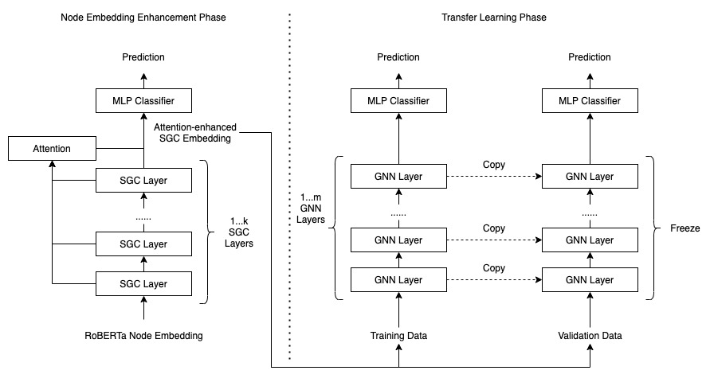

#  KDD Cup 2021: OGB_LSC_MAG240M

Implementation of our solution to the MAG240M track in KDD CUP 2021. For more detinformation, please refer to the **[OGB-LSC paper](https://arxiv.org/abs/2103.09430)** and the web page [OGB-LSC @ KDD Cup 2021 | Open Graph Benchmark (stanford.edu)](https://ogb.stanford.edu/kddcup2021/)

## Requirements

- ogb==1.3.1
- torch_sparse==0.6.9
- torch==1.8.1
- tqdm==4.60.0
- pytorch_lightning==1.2.0
- numpy==1.20.2
- torch_geometric==1.7.0
- scikit_learn==0.24.2

## Model Architecture



## Getting Started

The default path of the dataset  is `.`， you can change it with add  `--root <your_path>` in your command line.

### Pre-Process

```shell
python ./pre-process/sgc_embedding.py
python ./pre-process/mlp_attention.py
```

### Models

**Note**: The version must be consistent with the version saved by pytorch-lighting. If your `logs` file is not empty, please replace it with the corresponding version.

**RGAT with RoBerta embedding**

```shell
python ./model/rgnn.py --commit "rgat"
python ./model/rgnn.py --version 0 --commit "rgat" --evaluate --save_embed
```

**RGAT with SGC embedding**

```shell
python ./model/rgnn.py --commit "sgc_rgat"
python ./model/rgnn.py --version 1 --commit "sgc_rgat" --evaluate --save_embed
```

### Post-Process

**Transfer Learning**

```shell
python ./post-process/post_kfload.py --commit 'rgat'
python ./post-process/post_kfload.py --commit 'sgc_rgat' 
```

**Model Ensemble**

```shell
python ./post-process/ensemble.py
```

## Results

All the results are obtained in the following environment:

- **CPU**: Intel(R) Xeon(R) Silver 4216 CPU @ 2.10GHz * 2
- **GPU**: GeForce RTX 3090 (24GB)
- **RAM**: 256G, 3200MHz
- **HDD**: NVMe SSD 500GB,  410K IOPS

**Transfer Learning**

| Model        | None-tune | Rough-tune | Fine-tune |
| ------------ | --------- | --------- | --------- |
| RoBerta+RGAT | 0.7064    | 0.7294    | 0.7355    |
| SGC+RGAT     | 0.7081    | 0.7293    | 0.7359    |

The results above are obtained on the validation data. Also, since we use validation data in the transfer learning phase, the results of **Rough-tune** and **Fine-tune** are according 5-fold cross validation on validation data.

**Model Ensemble**

| Method      | Validation | Test   |
| ----------- | ---------- | ------ |
| Voting-Hard | 0.7413     | -      |
| Stacking    | 0.7427     | -      |
| Voting-Soft | 0.7440     | 0.7381 |

